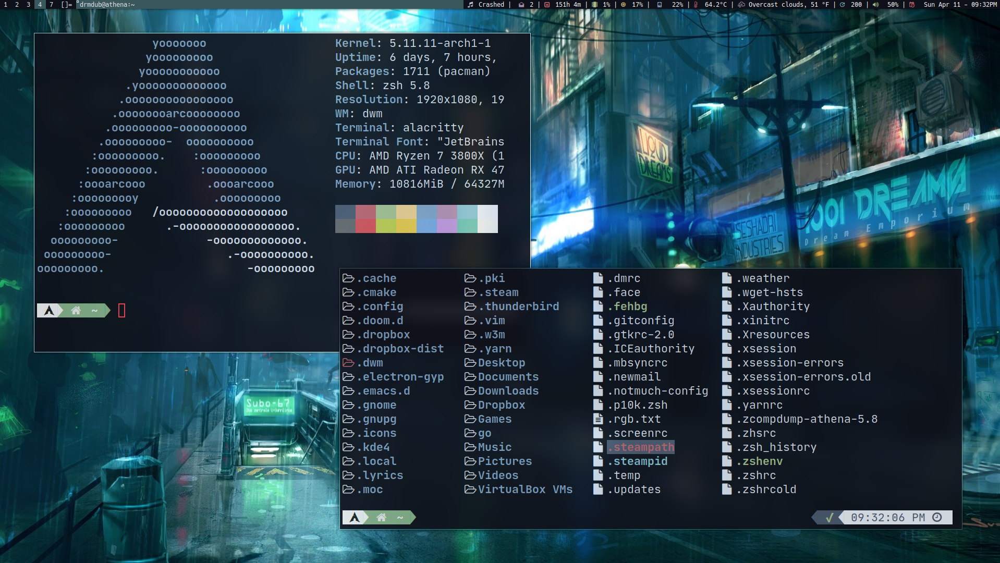

[Support Matt on Patreon](https://patreon.com/thelinuxcast)

# Matt's DWM Auto Installing - Ricing - Script

This script is meant for those who are intimidated by installing DWM by themselves or are (like Matt) just too lazy to do it. Just note that even after using this script there are still things you must do to get my setup. (Including setting up cronjobs and so on).

## Things to Know Before You Install
* You need to install git (either sudo pacman -S git or sudo apt install git).
* One of the scripts that the bar uses, weather.py, will need your own Open-WeatherAPI and your location to work. You can get these things by going to https://openweathermap.org
* If you encounter an error, be sure to get as much detail from the script as possible, then file an issue.
* The script has no error reporting. So if it errors out, the only notice you'll get is in the script output. I'm aware that this is not best practice, but I'm still learning bash.
* If you do not use the standard Download folder stucture (i.e $HOME/Downloads) you will need to edit the script and change the download of my scripts folder to whereever you please. 
* After install you'll need to run crontab -e and add in the crontab below. If you do not, several things will not work.
* This may or may not work on vanilla Arch Linux, depending on what repos you have enabled in your pacman.conf file.
* If you use a distro that defaults to wayland, you need to have xserver installed and all the appropriate dependencies.
* If you use a Display manager that runs in Wayland (GDM specifically), you'll find that DWM will log in and then pop you right back to the login screen. I'll do a video on how to fix this. 

# Usage

Step 1. Download the script

	git clone https://github.com/mtwb47/dwmricer.git

Step 2. CD into that directory

	cd dwmricer

Step 3.  Now, run the script. DO NOT RUN AS ROOT!

	./dwmricer

You will be prompted for your password. You may also be asked to confirm the installation of some software by pressing the y button. Do so. If on Arch or an Arch-based distro, you may be asked which of the base-devel packages to install. Just press enter and install all of them. 

Step 4. Copy this crontab after running "crontab -e" (without the quotes) NOTE: You may need to install cronie for this to work.

	SHELL=/bin/bash
	MAILTO=root@example.com
	PATH=/bin:/sbin:/usr/bin:/usr/sbin:/usr/local/bin:/usr/local/sbin
	@hourly weather.py >> .weather
	@daily pacupdate.sh >> .updates
	*/3 * * * * temp.sh

Step 5. Log out of your current DE or Window Manager.

Step 6. Log into DWM. (There should be a little cog or something on your log in screen to change your current session)

# Keybindings That You Should Know
MOD Enter -- Spawn a terminal (if you have alacritty installed)

MOD p --- spawn dmenucmd

MOD j --- focusstack +1

MOD k --- focusstack -1

MOD i --- incnmaster +1

MOD h --- setmfact -0.05

MOD l --- setmfact +0.05

MOD Tab --- view

MOD q --- killclient

MOD t --- setlayout layouts[0]

MOD F1 --- setlayout layouts[2]

MOD m --- setlayout layouts[1]

MOD F2 --- setlayout layouts[3]

MOD F3 --- setlayout layouts[4]

MOD F4 --- setlayout layouts[5]

MOD F5 --- setlayout layouts[6]

MOD F6 --- setlayout layouts[7]

MOD F7 --- setlayout layouts[8]

MOD F8 --- setlayout layouts[9]

MOD F9 --- setlayout layouts[10]

MOD F10 --- setlayout layouts[11]

MOD f --- setlayout layouts[12]

MOD + Ctrl comma --- cyclelayout -1

MOD + Ctrl period --- cyclelayout +1

MOD space --- setlayout

MOD space --- setlayout

MOD + Shift j --- movestack +1

MOD + Shift k --- movestack -1

MOD + Shift space --- togglefloating

MOD 0 --- view ~0

MOD + Shift 0 --- tag ~0

MOD Left --- focusmon -1

MOD Right --- focusmon +1

MOD + Shift Left --- tagmon -1

MOD + Shift Right --- tagmon +1

MOD y --- togglescratch 0

MOD u --- togglescratch 1

MOD n --- togglescratch 2

MOD + Shift n --- togglescratch 3

MOD o --- togglescratch 4

MOD + Shift x --- quit

---------------------

# Things that Could Go Wrong

* My rice of DWM needs Nerd Fonts installed. If you don't have them, you'll need to do so.

* If DWM won't load, chances are it it did not compile correctly, either due to a missing dwm dependency or a permissions issue. Submit an issue and I'll try to help.

# Things to Do in the Future
✅ Figure out how to install the fonts from the script itself.
* Actually set a wallpaper.
* Give options to user for when I change my rice so they can choose between my new one and the previous one. 
* Error reporting, and better scripting for when something goes wrong.  (this is a major one that I'll be working on next)
